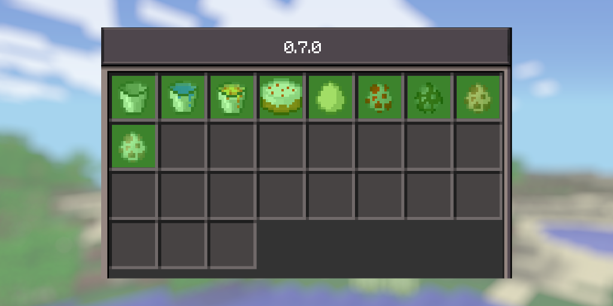

# neoMCPE 0.7.2-alpha-1.0.3b

## Changes

* Fully port mcpe 0.7.2
* Theres now a player list on the pausemenu
* Pressing "Edit" on the world selection screen now shows world [seeds](https://minecraft.wiki/w/Seed_(world_generation)).
* Backported 0.7.2 chat gui and packet
* Slight GUI change
* The multiplayer servers now show up at the top of the play menu, rather than the bottom.
* Made Buckets more accurate(their ids now match 0.7.0)
* Made MonsterPlacer(Spawn eggs) more accurate
* Fixed joinbyipscreen
* Fixed restored animations not showing the player's hand
* Fixed Melon seeds and Pumpkin seeds names
* Made options more accurate
* Added the textboxes from 0.7.0
* Fixed sliders in options so you wouldnt have to click/tapping them twice
* Made sliders "teleport" to where you're clicking/tapping to make them accurate
* Changed the name at the top of releases from "NeoMCPE" to "neoMCPE" due to request from the creator of neoLegacy :>

## Known bugs
* Something seems wrong with the chat packet as it somewhat dosnt recognise the one from real 0.7.0 and looks buggy for some reason
* The scrolling in TouchSelectWorldMenu is not accurate to real 0.7.0 as i couldnt figure out how to port it(its really buggy rn)

## Roadmap

